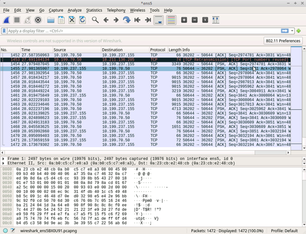
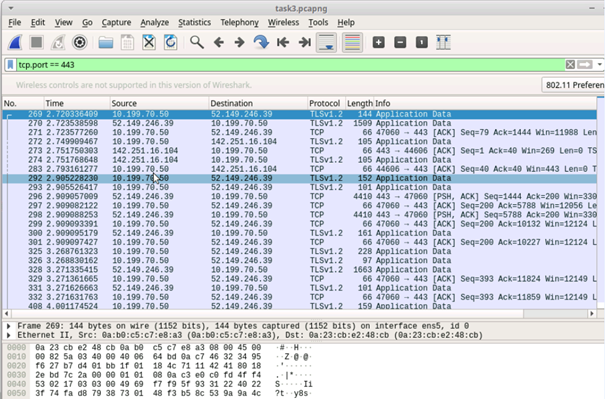
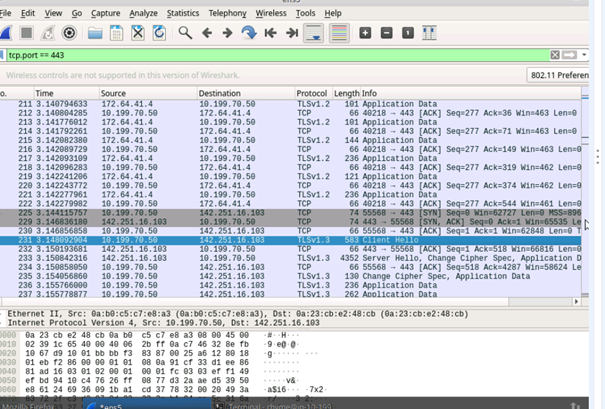
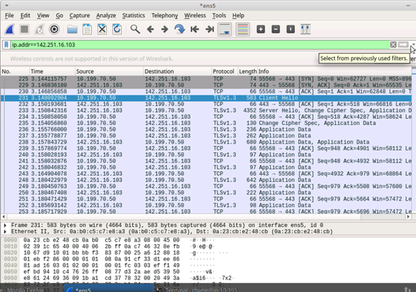
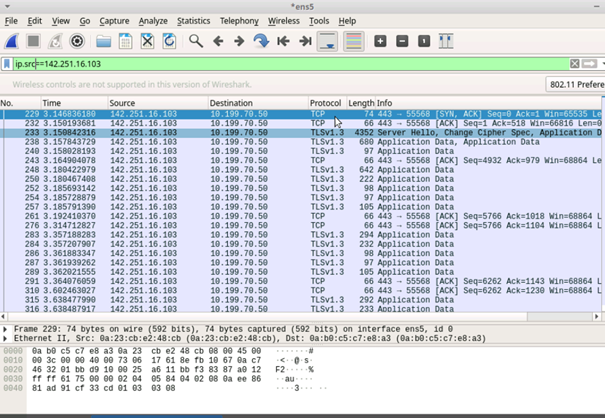
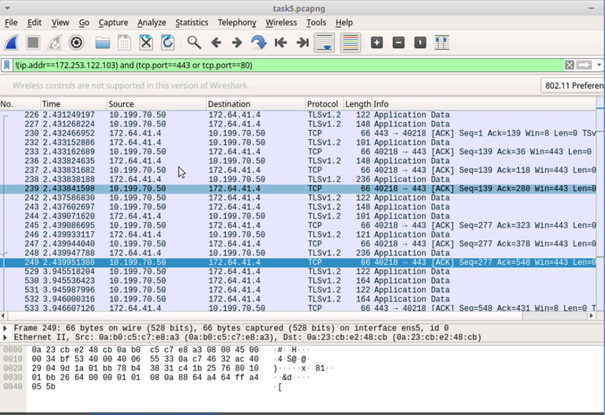

# Wireshark-For-Beginners-Capture-Packets
A short guided project implemented on Coursera platform to upgrade my skills using Wireshark.

 

**Task 1 - Start a packet capture on an ethernet port and save it to file.** 

I opened a new file in Wireshark to catch all the network traffic on my computer.

It was just a warm-up.

 
 

**Task 2 - Use a display filter to detect HTTPS packets**

Using a command "tcp.port==443" I filtered network traffic to see traffic for https protocol.

 
 

**Task 3 - Visit a web page and detect its IP address using a display filter**

I started catching traffic travelling to google.com

On the screenshot we can see two specific packets. "Server Hello" and "Client Hello". Thesea are first packets exchanged between web browser and google.com.

After this using command "ip.addr==142.251.16.103" I filtered packets to see only these from and to google.com.

Then, changing the command to "ip.src==142.251.16.103" I viewed only packets coming FROM google.com.

As we can see, the "Client hello" disappeared and "Server Hello" remained.

 
 

**Task 4 - Locate all HTTPS packets from capture not containing a certain IP address**

In this last task I used exclamation mark in front of command "(ip.addr==172.253.122.103)" to filter packets NOT coming from this specific ip address.

The second part of this command "(tcp.port==443 or tcp.port==80)" displayed traffic coming through these two ports responsible for http and https traffic.

The "and" operator combined these two commands to show me traffic NOT coming from specified ip address and from two exact ports.

